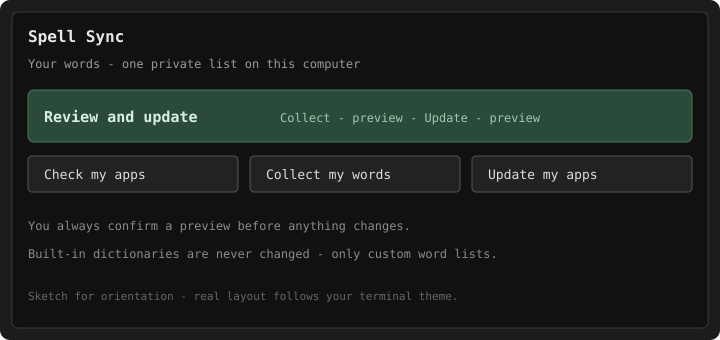

# Spell Sync

**Keep personal spelling words in one place — and sync them between your apps.**

[](https://github.com/arthurakbarov/spell-sync/actions/workflows/ci.yml)
[](LICENSE)

You teach a browser or editor a personal word — then another app underlines it again.
Spell Sync keeps those words in **one private list** on your computer and copies them
into supported apps' **custom** dictionaries.

```text
Collect my words:   your apps → your word list
Update my apps:     your word list → your apps
```

- You always see a **preview** and confirm before anything changes.
- **Collect** never removes words from your personal list.
- **Update** may remove custom words that are no longer in your list.
- **Built-in dictionaries are never changed.**



## Is this for you?

**Yes, if:**

- The same name, product term, or abbreviation is “wrong” in one app and fine in another
- You are willing to open a **terminal** for about five minutes of first setup
- You use at least one app with a custom dictionary Spell Sync can find. Implemented
  is not the same as a recorded real-app check — see [Supported apps](docs/SUPPORTED_APPS.md)

**Not for you if:**

- You want a click-install GUI with no terminal
- You cannot install — or would rather not install — **Python 3.14** (see [Install](#install))
- You need Spell Sync to invent or replace a built-in system/app dictionary
- You expect automatic sync over the internet (multi-computer sync is optional: synced
  folder or private Git — see [Personal Workspace](docs/PERSONAL_WORKSPACE.md))

## Start here

**Primary path:** follow [Getting Started](docs/GETTING_STARTED.md) —
install checklist → open a folder → **Start here** → add a word (or Collect) →
**Update my apps**.

That guided flow is the product. The command table below is only for people who already
prefer the shell.

## Install

You need **Python 3.14** and a terminal.

Stable release (**recommended**):

```bash
# install uv if you do not have it: https://docs.astral.sh/uv/
uv tool install git+https://github.com/arthurakbarov/spell-sync@v1.0.0
uv tool update-shell   # if `spell-sync` is not on PATH yet
spell-sync
```

Or with pip (user install into a supported Python 3.14 — not Homebrew `pip install -e`):

```bash
python3.14 -m pip install --user \
  "spell-sync @ git+https://github.com/arthurakbarov/spell-sync@v1.0.0"
# then ensure your user scripts directory is on PATH
spell-sync
```

Tip of `main` (post-release hygiene; may differ from tag `v1.0.0`):

```bash
uv tool install git+https://github.com/arthurakbarov/spell-sync@main
```

Wheel/sdist assets: [GitHub Release v1.0.0](https://github.com/arthurakbarov/spell-sync/releases/tag/v1.0.0).

If the command is missing or prints `bad interpreter`, see
[Troubleshooting](docs/TROUBLESHOOTING.md#spell-sync-was-installed-but-the-command-is-not-found)
and
[bad interpreter](docs/TROUBLESHOOTING.md#bad-interpreter-when-running-spell-sync).

## First run

```bash
mkdir ~/my-words && cd ~/my-words
spell-sync
```

Then: **Start here** → choose a folder → pick apps → **Create project** → choose
**Add words** or **Collect**, then **Update my apps**. Confirm each preview.

First-run defaults turn on common apps when they are found on your machine. Change them
later under **Applications**. Real-application validation is still growing — see
[Supported apps](docs/SUPPORTED_APPS.md).

## Commands

Guest-facing names first; CLI verbs in parentheses:

| Goal | Command |
|------|---------|
| Interactive TUI | `spell-sync` |
| Non-interactive setup | `spell-sync init` |
| Add words to the list | `spell-sync add WORD [WORD...]` |
| Collect my words (Pull) | `spell-sync pull` |
| Check my apps (Status) | `spell-sync status` |
| Preview Update my apps (Plan) | `spell-sync plan` |
| Update my apps (Push) | `spell-sync push` |
| Finish interrupted update | `spell-sync recover` |
| Check health | `spell-sync doctor` |
| Save word list to Git (optional) | `spell-sync git-save` / `spell-sync git-save --push` |
| Privacy-safe support bundle | `spell-sync support-report` |

## Docs

| Doc | Purpose |
|-----|---------|
| [Getting Started](docs/GETTING_STARTED.md) | Step-by-step first run |
| [Supported apps](docs/SUPPORTED_APPS.md) | What Spell Sync can sync |
| [Configuration](docs/CONFIGURATION.md) | `spell-sync.toml` |
| [Recovery](docs/RECOVERY.md) | Interrupted updates |
| [Troubleshooting](docs/TROUBLESHOOTING.md) | Common failures |

## License

[Unlicense](LICENSE) — public domain dedication.
